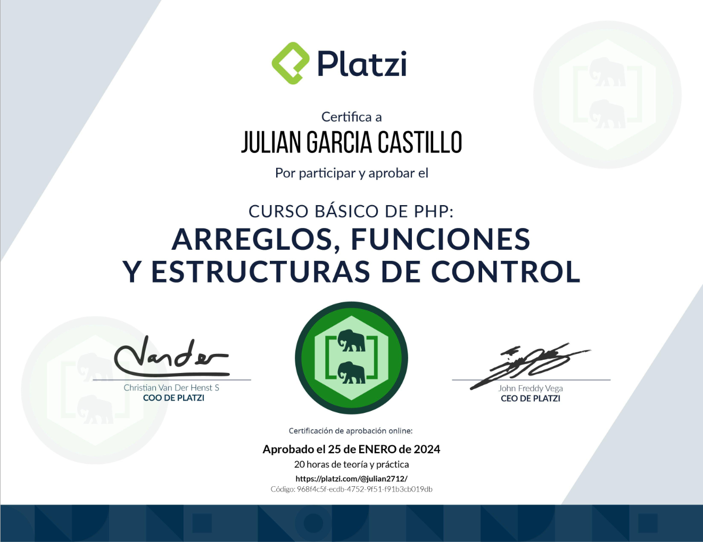

## Ruta PHP
### Curso 2

# Descripción
Domina los fundamentos de programación con PHP. Implementa arreglos, funciones, ciclos y condicionales para desarrollar un juego de ahorcado en la terminal con PHP